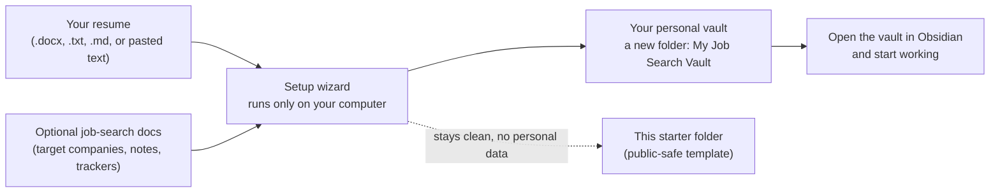
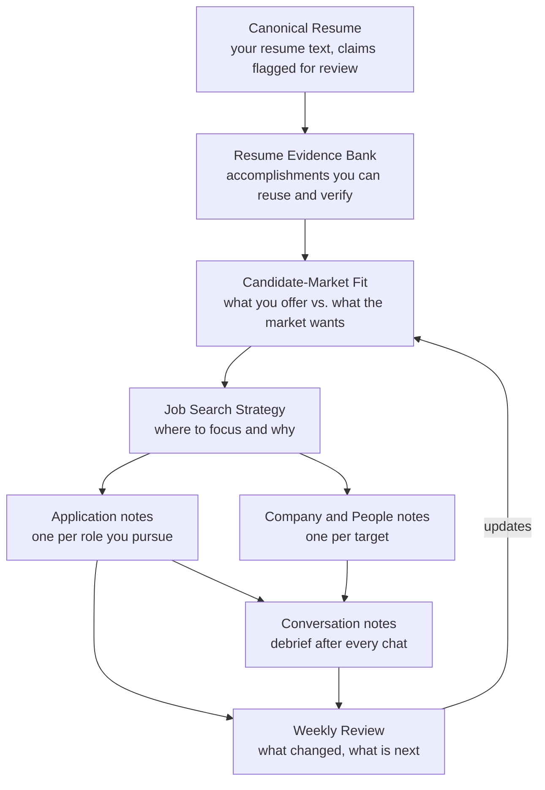
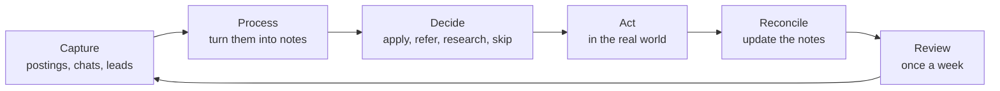
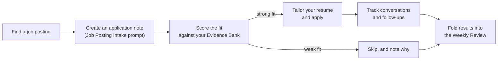

# Job Search Memex Starter

Turn your resume into a personal job-search headquarters: a folder of plain-text notes that tracks your evidence, applications, companies, conversations, and weekly progress — set up for you by an AI assistant or a simple local wizard, and kept entirely on your computer.

## What Is This?

A **Memex** is a personal memory system: everything you know and learn, connected in one place. This project is a Memex for one specific mission — **running a job search well**.

A job search generates a lot of scattered information: versions of your resume, job postings, recruiter chats, coffee-chat notes, application statuses, half-formed strategy thoughts. Most people track this in their head, a messy spreadsheet, or not at all. This starter gives that information a home:

- **Every claim in your resume becomes reusable evidence** you can pull into tailored resumes and interview answers.
- **Every application, company, person, and conversation gets its own note**, linked to the others.
- **A weekly review** keeps you honest about momentum and what to change.

The notes are ordinary Markdown files. You can read them in any text editor, but they are designed for [Obsidian](https://obsidian.md) (a free notes app) where the links between notes become clickable and browsable.

Two things make this starter different from a template you fill in by hand:

1. **A setup wizard builds your vault from your resume.** You give it your resume (a Word file is fine); it creates the structured notes for you.
2. **It is built to be driven by an AI assistant** (Claude Code, Codex, Cursor, and similar tools) — with guardrails. The AI helps you structure and enrich, but it is explicitly forbidden from inventing facts about you: every number is flagged for your verification, and anything you haven't told it stays marked as *missing* rather than guessed.

## How Setup Works

You point an AI coding tool (or the wizard directly) at this folder. Your personal vault is created **next to** this folder, not inside it — so your private information never mixes with this public template.



The wizard runs only on your machine. It makes no internet calls and sends your resume nowhere.

## The Design: How the Notes Fit Together

Your vault is a small system, not a pile of notes. Everything flows from your resume toward decisions and weekly review:



What each piece is for:

| Note | Plain-language purpose |
| --- | --- |
| **Canonical Resume** | The single source of truth for your resume text, with every metric and date flagged for you to verify. |
| **Resume Evidence Bank** | Your accomplishments, organized by role, ready to reuse in tailored resumes and interview answers. |
| **Candidate-Market Fit** | An honest picture of what you offer versus what the market is asking for — and what to test in conversations. |
| **Job Search Strategy** | Where you're focusing and why, so effort doesn't scatter. |
| **Applications / Companies / People / Conversations** | One note per real-world thing, created from templates as you go. |
| **Weekly Review** | A short weekly check-in: metrics, signals, and next priorities. |

The `System/` folder holds the machinery: note **Templates**, AI **Prompts** (job posting intake, fit scoring, conversation debrief, weekly review), **Bases** (table views for Obsidian), and **Workflows** (the rules below).

## The Intended Workflows

### The weekly operating loop

The vault runs on one repeating loop. The system helps you see fit and momentum — it never makes the decisions for you.



### When you find a job posting



## Quick Start

### Path 1: With an AI coding tool (easiest)

1. Open this folder in Claude Code, Codex, Cursor, or a similar tool.
2. Say:

```txt
Set up this job-search Memex for me using my resume and job-search docs.
```

3. Answer its questions (target roles, location, deal-breakers — skip any you haven't decided).
4. When it finishes, open the new `My Job Search Vault` folder in Obsidian (**Open folder as vault**) and start at `01 Start Here/Start Here.md`.

### Path 2: Double-click

Double-click `Start Onboarding.command` (Mac) or `Start Onboarding.bat` (Windows) and answer the prompts.

### Path 3: Terminal

```bash
npm start
```

All three paths run the same local wizard.

## Prerequisites

- **Required:** [Node.js LTS](https://nodejs.org) (which includes npm). Nothing else.
- **Recommended:** [Obsidian](https://obsidian.md) desktop, free, for working with your vault.
- **Optional:** an AI coding tool (Claude Code, Codex, Cursor, or similar) to drive setup and ongoing enrichment.

If you're not sure whether Node.js is installed, just try the double-click launcher — it will tell you.

## What Setup Creates

Your personal vault (default `../My Job Search Vault`, next to this folder) contains:

- `01 Start Here/` — orientation and a first-week checklist
- `02 Projects/Job Search.md` — your mission-control note with targets and constraints
- `06 Synthesis/Career/` — Canonical Resume, Resume Evidence Bank, Candidate-Market Fit, Job Search Strategy
- `01 Reviews/Weekly/` — your first weekly review, dated
- `04 Objects/` — empty homes for Applications, Companies, People, and Conversations
- `System/` — the templates, prompts, and workflows copied from this starter, so the vault stands alone

Every generated note is marked `review_needed: true`, and facts, inferences, claims to verify, and missing inputs are kept separate. Nothing is presented as true until you've reviewed it.

Advanced users can pass `--in-place` to set up inside this starter clone instead; the wizard then renames the git remote as a safety guard against accidentally publishing personal data.

## Inputs

The wizard accepts pasted text, `.txt`, `.md`, and `.docx` (Word) files.

Start with your **resume**. Optionally add: a Candidate-Market Fit worksheet, Never Search Alone / listening-tour notes, target-company lists, networking maps, strategy drafts, or a prior application tracker.

`.pdf` files are not parsed — copy-paste the text instead, or re-save the file as `.docx` or `.txt`.

## Working With an AI Assistant

`AI_ONBOARDING.md` is the contract an AI assistant follows here. The short version of its guardrails:

- It must **never invent** experience, metrics, companies, contacts, compensation, or constraints.
- Anything you haven't provided stays listed under **Missing Inputs** — not guessed.
- Every number from your resume lands in a **Claims To Verify** list for you to confirm.
- Your resume and notes are **not sent to any external service** unless you explicitly approve it.
- Your personal vault is **never committed to this public starter**.

## Privacy and Safety

- The wizard runs locally and makes no external API calls.
- Your personal vault is created outside this folder, with no connection to the public project online.
- Raw source documents are not stored unless you explicitly opt in (`Private/` inside the vault is ignored by Git for that purpose).
- See `PRIVACY.md` for the full public-safety rules.

## Validation

- `npm run validate` — checks this starter template itself, including a scan for private strings. For template contributors.
- `npm run validate:vault` — checks a personal vault (structure and review-gating only), so a personalized vault passes cleanly. The generated vault's own `npm run validate` runs this mode.

## Examples

`examples/fictional-demo/` contains a fully fictional sample vault. Safe to inspect or delete.

## License

MIT. See `LICENSE`.
